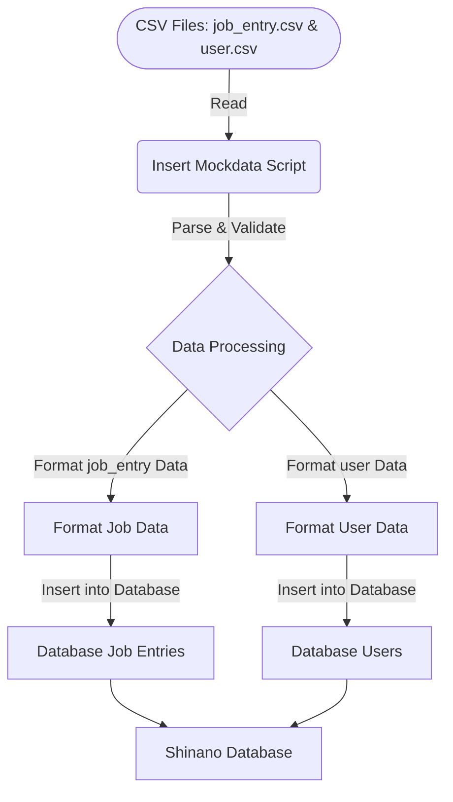

# README for Shinano Mockdata Directory

## Overview
This directory contains mock data and scripts for the Shinano project. These files are used to populate the Shinano database with sample data for development and testing purposes.


## Directory Contents

### `insert_mockdata.php`
A PHP script that inserts mock data into the Shinano database from CSV files. It includes functions to parse CSV files and insert their contents into the database.

```php
<?php
// [PHP script content]
?>
```

### `job_entry.csv`
A CSV file containing mock data for job entries. It includes fields such as `id`, `attribute`, `user`, `title`, `description`, and various timestamps.

```
id , attribute , user , title , description , created_at , updated_at , opened_at , closed_at
// [Sample data rows]
```

### `user.csv`
A CSV file with mock user data. This file includes fields like `id`, `name`, `email`, `password`, `note`, and timestamps.

```
id , name , email , password , note , created_at , updated_at , deleted_at
// [Sample data rows]
```

## Usage

- To insert mock data into the Shinano database, run the `insert_mockdata.php` script. This script will read the CSV files and populate the database tables accordingly.
- Ensure that the database is properly set up and accessible before running the script.
- Modify the CSV files as needed to test different data scenarios.

## Additional Notes

- The `insert_mockdata.php` script assumes the database connection is correctly configured and accessible.
- The CSV files should be kept up-to-date with the database schema to prevent any insertion errors.
