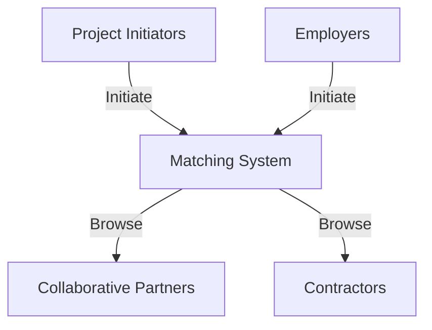
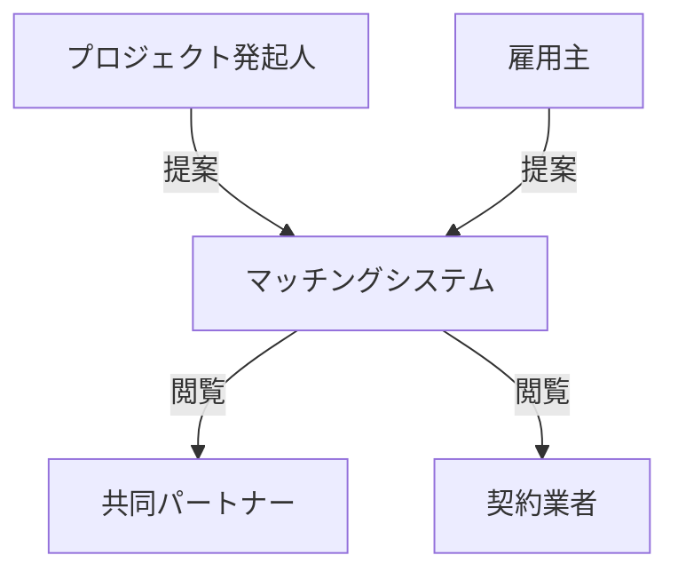

# Shinano Project

## Introduction

Welcome to the Shinano Project. 
Our platform is specifically designed to create direct connections: connecting those initiating projects with collaborative partners, and linking employers with contractors seeking opportunities.

Our mission is to nurture autonomous, collaborative, and sustainable work practices. We aim to spread the principles of economic democracy in society, exemplified by such concepts as
[ *Worker Cooperatives and Solidarity Economy*](#-worker-cooperatives-and-solidarity-economy)

## Purpose of Shinano Software and Web Service

The Shinano software and web service are designed to cover the full range of
collaboration/joint venture and employment needs.
For individuals or groups with new ideas or
specific projects, it offers a platform to share their plans and connect with
interested, engaged collaborators. Additionally, it serves as a resource for
contractors seeking employment and for employers looking for skilled
contractors. This system is focused on promoting collaborative and equitable
economic activities by completely eliminating margins and intermediaries. Our
aim is to create an open and democratic environment, ensuring equal
opportunities for all participants.



## Organizational Structure & Policy

The Shinano Project and its system are currently developed and run by the
TNG Worker Cooperative in Yugawara, Japan, with an eye toward evolving into a
more democratically structured organization that includes its users.
The system is offered free of charge, with TNG recognizing its
significant value for internal use as a participant.

The matching system is designed as an alternative to traditional phone
communication and does not involve itself in individual labor or other contract
negotiations, which are managed directly by the involved parties. In line with
our flexible content policy, if postings are found that may not fully align with
the platform's primary objectives, our approach is to engage in open dialogue.
The operating body, committed to democratic principles, prefers to discuss
constructively with those involved to find amicable solutions or adjustments,
rather than enforce strict compliance.

### * Worker Cooperatives and Solidarity Economy

#### ** Worker Cooperatives

Worker cooperatives are democratically-run businesses owned by their worker/owners.
Each member has an equal vote in the highest enterprise decision-making bodies.

#### ** Solidarity Economy

The solidarity economy emphasizes meeting human and environmental needs over profit.
It values mutual aid, cooperation, economic democracy, sustainability, and social justice.
This approach aims to create an inclusive, equitable society that respects both people and the planet.

## はじめに

信濃プロジェクトへようこそ。起業・企画の発案者と参加者、または雇用者と請負業者の間の
直接的なマッチングを促進することに注力している当プラットフォームは、自律的、協調的、
持続的な働き方を促進し、経済の民主主義、具体的には[ *労働者協同組合、連帯経済*](#-労働者協同組合と連帯経済)などと呼ばれる概念を社会に広めることを目指しています。

## 信濃プラットフォームとウェブサービスの目的

信濃のソフトウェアとウェブサービスは、協力と雇用の両面に対応するように設計されています。
新しいアイデアや特定のプロジェクトを持つ個人またはグループには、その計画を共有し、共感を
持つ協力者と繋がるためのプラットフォームを提供します。
また、契約を探している請負業者や
技能を求める発注者のマッチを行います。
このシステムは、中間業者、参加費用などを排除することで、
協力的で公正な経済活動を促進することを目指しています。



## 運営母体・運営方針

信濃プロジエクトとそのシステムは、神奈川県湯河原町にあるTNG労働者協同組合が当初設立・
運営をしていますが、将来的にはシステムの利用者と団体を形成し、より民主的な運営に移行
する方針です。システムの利用は無料で、その理由は我々TNG組合も参加者としての利用
価値を見出しているからです。
当マッチングシステムはあくまでも「電話の代わり」であり、個々の労働・その他契約などに
一切関与しません。契約は当事者同士でお願いします。
ただし、本プラットフォームの目的にそぐわない掲示などがあった場合、運営方針は柔軟に
対応することを重視しています。当組合は、民主的な原則に従い、対話と協力を通じて
調整することを望んでいます。

### * 労働者協同組合と連帯経済

#### ** 労働者協同組合

労働者協同組合は、従業員/所有者によって所有され、民主的に運営される組合です。
各組合員は企業の最高意思決定機関で平等な投票権を持っています。
(非常にわかりやすい例：　個人事業主が集団でラーメン屋をやる。当て言えば「集団事業主」)

#### ** 連帯経済（つながりの経済・ふれあい経済）

連帯経済は、利益よりも人間と環境のニーズを満たすことを重視します。
相互扶助、協力、経済民主主義、持続可能性、
社会正義を価値観としています。このアプローチは、
人々と地球の両方を尊重する包括的で公平な社会を創造することを目指しています。

## Technical Dependencies and Standards

Our software relies on the following technologies and standards:

1. **HTTP Server**: Essential for handling web requests.

2. **PHP (Version 8.2.13)**:
   - Utilized for server-side application development.
   - Currently in PHP, with plans to transition to Haskell for enhanced functionality.

3. **MySQL (Version XX.XX)**:
   - Our chosen database management system.
   - Reliable and efficient for handling data requirements.

4. **HTML + CSS**:
   - Follows MDN standards ([HTML](https://developer.mozilla.org/en-US/docs/Web/HTML) and [CSS](https://developer.mozilla.org/en-US/docs/Web/CSS)).
   - Essential for designing a responsive and visually appealing user interface.

5. **Javascript**:
   - Adheres to the standard of XXXX (Link).
   - Primarily used for browser-completed animations.
   - Not utilized for server communication or content text calculations.

The front-end is designed to be wget friendly and compatible with text-based web browsers, with a static approach.

## Usage

1. **PHP**:
   - To start the PHP server, navigate to the document index at './studyyard' and use the following command:
     ```
     $ php -S localhost:5000 -t ./studyyard/ -a
     ```
   - Access localhost:5000 to view content and interact with PHP request handlers.

2. **SQL**:
   - [Details about SQL usage and commands]

3. **Deployment Server**:
   - [Instructions for server deployment]

## Branch Information

| Name    | Purpose                                              |
| ------- | ---------------------------------------------------- |
| main    | Current stable software version and its source code. |
| develop | Branch used for development.                         |

## Feedback and Contributions

We encourage users to provide feedback and suggestions for improvements. Your input is valuable in refining and enhancing the Shinano software and its supporting elements.

#### Converting This Document to PDF

To convert markdown documents to PDF, use the `md-to-pdf` command. Run the following command in your terminal:

```bash
npx md-to-pdf
```

When you run the command, you can expect the following output:

```bash
nodePath: /home/yasu/co/shinano/node_modules/md-mermaid-to-pdf/lib
mermaidCode: 3524456
is mermaid
is mermaid
  ✔ generating PDF from README.md
```

[NPX command above comes with NPM](https://nodejs.org).