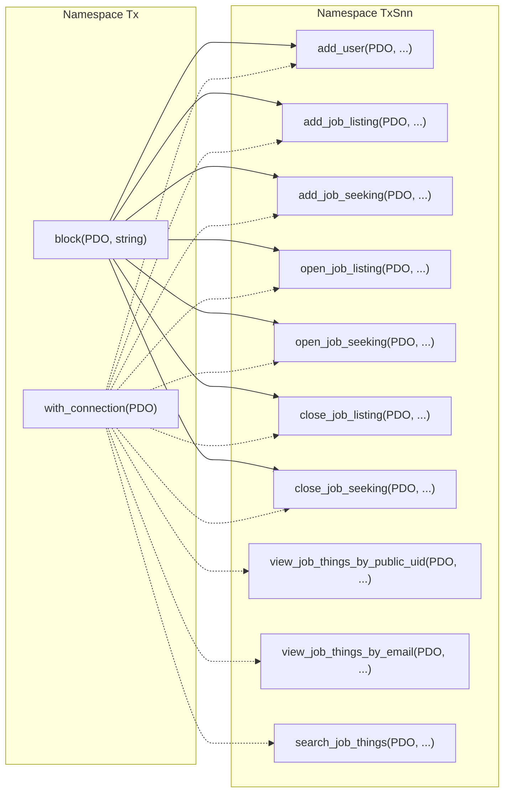

# PHP Transaction Management Library for Shinano

## Overview

This PHP library, developed for the Shinano project, is designed for efficient transaction management in database operations. It is optimized for low-cost, low-resource computing environments and leverages functional programming principles for managing database connections and transactions effectively.

## Features

- **Functional Programming Approach**: Implements higher-order functions and closures, promoting a functional programming style that is efficient and resource-conscious.
- **Efficient Transaction Management (Tx)**: The `Tx` namespace provides a structured way to handle database transactions, ensuring data integrity and efficient use of database connections.
- **Exception Handling and Rollback**: Robust exception handling within transaction blocks is included to maintain data consistency and minimize resource wastage in case of errors.
- **Optimized Database Interaction**: Uses PHP Data Objects (PDO) with specific attributes like persistent connections and custom error handling to optimize database communication.
- **Resource Conscious Configuration**: Configured to prevent unnecessary data buffering and potential resource leaks, which is crucial in low-resource environments.

## Usage

The library is composed of two main namespaces: `Tx` (Transactions) and `TxSnn` (Shinano-specific transactions).

### `Tx` Namespace

This namespace includes core functions for managing database connections and transactions.

#### Functions:
- `with_connection`: Creates a PDO connection and provides it to a transaction function.
- `block`: Manages transaction blocks, handling commit and rollback based on execution success.

### `TxSnn` Namespace

Contains functions specifically tailored for the Shinano project's transactional operations.

#### Functions:
- `add_user`: Adds a new user to the database.
- `add_job_listing`, `add_job_seeking`: Manages job listings and job seeking entries.
- `open_job_listing`, `open_job_seeking`: Opens job listings or seeking entries.
- `close_job_listing`, `close_job_seeking`: Closes job listings or seeking entries.
- Additional utility functions for user and job entries management.

## Project-Specific Notes

The library is tailored for the Shinano project, focusing on environments where efficient resource usage is critical, such as in low-cost computing scenarios.

## Schematics



### Fetching User Data by Public UID

```php
\$ret_stmt_user = \\Tx\\with_connection(\$data_source_name, \$sql_ro_user, \$sql_ro_pass)(
    function(\$conn_ro) use (\$request_public_uid){  
        \$sql1 = "SELECT name, email, public_uid, note, created_at"
              . " FROM user"
              . " WHERE public_uid = :public_uid";
        \$stmt = \$conn_ro->prepare(\$sql1);
        \$stmt->execute(['public_uid' => \$request_public_uid]);
        return \$stmt;
    });
```

In this example:
- `\$data_source_name`, `\$sql_ro_user`, and `\$sql_ro_pass` are the database connection parameters (like DSN, read-only user, and password).
- `\$request_public_uid` is the public UID for which the user data is being requested.
- The closure passed to `with_connection` prepares and executes a SQL query to fetch user details based on the provided public UID.
- The function returns a PDOStatement object (`\$stmt`) that can be used to fetch the desired data.
