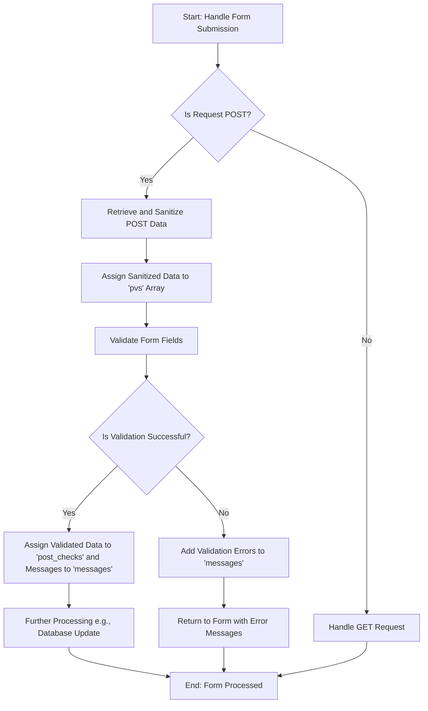

```mermaid
flowchart TD

    A[Start: Handle Form Submission] --> B{Is Request POST?}
    B -- Yes --> C[Retrieve and Sanitize POST Data]
    B -- No --> E[Handle GET Request]
    C --> D[Assign Sanitized Data to 'pvs' Array]
    D --> F[Validate Form Fields]
    F --> G{Is Validation Successful?}
    G -- Yes --> H[Assign Validated Data to 'post_checks' and Messages to 'messages']
    G -- No --> I[Add Validation Errors to 'messages']
    H --> J[Further Processing e.g., Database Update]
    I --> K[Return to Form with Error Messages]
    J --> L[End: Form Processed]
    K --> L
    E --> L

```